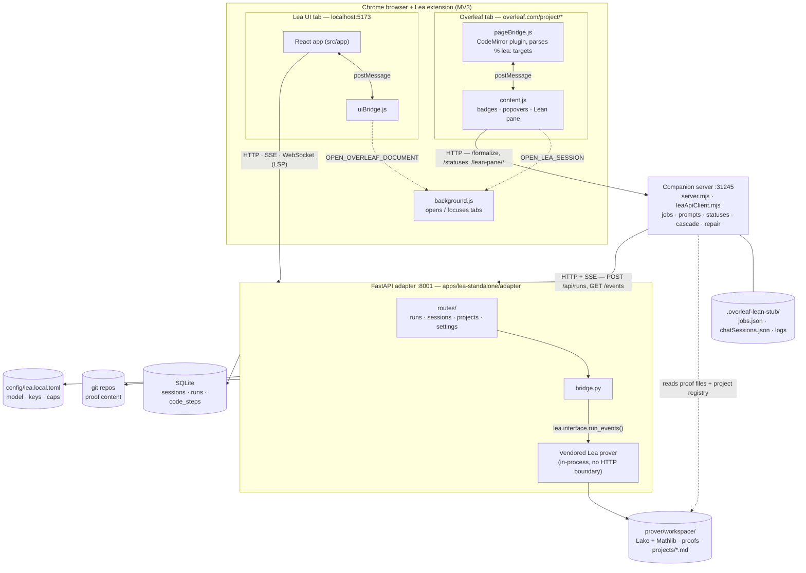

# LeaEcosystem system report — with focus on the Overleaf extension

> Snapshot as of 2026-07-10 (main @ `15edcd1`). This documents the *current*
> in-process architecture. (Correction, same day: the root `README.md` and
> `apps/lea-standalone/README.md` were verified current — the earlier
> "stale docs" warning in `CLAUDE.md` described a pre-`easy_install` state
> and has been removed.) When prose and code disagree, trust the code.

## 1. The big picture

LeaEcosystem is an npm-workspaces monorepo that puts **two front ends** on top
of **one shared backend** for Lea, a Lean 4 theorem-proving agent.

The single most important architectural fact: **there is no prover HTTP
service**. The FastAPI adapter imports the vendored prover in-process as a
library ([bridge.py](../apps/lea-standalone/adapter/app/bridge.py) calls
`lea.interface.run_events(...)` directly) and translates its typed events onto
an SSE stream. Everything — the standalone UI *and* the Overleaf path —
converges on this one adapter on port **8001**.

The Overleaf path's default flow:

```text
Overleaf page → Chrome extension → companion (:31245) → FastAPI adapter (:8001) → prover (in-process)
```



| Service | Port | Started by |
|---|---|---|
| FastAPI adapter (the backend) | 8001 | `npm run start:adapter` / `dev:ui` |
| Vite web dev server (the UI) | 5173 | `npm run dev:ui` |
| Overleaf companion server | 31245 | `npm run dev:overleaf` |

## 2. The Overleaf extension app (`apps/overleaf-extension/`)

This app has three layers: the **Chrome MV3 extension** (what runs in the
browser), the **companion server** (a local Node orchestrator), and a small
**shared** library both use.

### 2a. Chrome extension — `extension/`

| File | Role |
|---|---|
| [manifest.json](../apps/overleaf-extension/extension/manifest.json) | MV3 manifest. Injects `content.js` into `overleaf.com/project/*` and `uiBridge.js` into the Lea UI origin (`localhost:5173`). Exposes the `.mjs` modules as web-accessible resources so the content script can lazy-`import()` them. |
| [content.js](../apps/overleaf-extension/extension/content.js) | The heart of the extension (~4,000 lines, classic IIFE). Injects the page bridge, renders status badges over marked theorems, the click popovers with Formalize / Stub / View in Lea UI actions, the settings popover, the resizable Lean pane (project file tree, per-item Lean code, chat mirror, manual edit, repair buttons, export/GitHub-share panel), usage/cost display and spend-cap notices, and the `.tex` mirror sync. All backend interaction goes to the companion at `http://127.0.0.1:31245`. |
| [pageBridge.js](../apps/overleaf-extension/extension/pageBridge.js) | Injected **into the page context** (content scripts can't touch Overleaf's CodeMirror 6 instance). Hooks Overleaf's `UNSTABLE_editor:extensions` event to register a CodeMirror ViewPlugin that parses the document for Lea targets, decorates them, and relays clicks/targets to `content.js` via `window.postMessage`. Also handles "scroll to source" navigation. |
| [targetParserCore.mjs](../apps/overleaf-extension/extension/targetParserCore.mjs) | The pure LaTeX target parser. Finds `% lea: formalize label=... uses={...} context={...}` comment markers inside `theorem`/`lemma`/`proposition`/`corollary`/`definition` environments, plus the inline tag commands (`\leatheorem`, `\leadefinition`, generic `\lea{kind=...}`) from `lea-tags.sty` for custom environments and standalone statements. Emits both targets and diagnostics (duplicate labels, invalid identifiers, tags in suspicious environments, `tag_package_not_loaded`, …). Used by the page bridge, the shared parser, and the companion — one grammar, three consumers. |
| [leanPaneView.mjs](../apps/overleaf-extension/extension/leanPaneView.mjs) | Pure, DOM-free helpers for the Lean pane (status labels, Lean syntax highlighting tokens, LaTeX→Unicode math rendering, file-tree building). Split out of `content.js` specifically so it's unit-testable. |
| [zipTex.mjs](../apps/overleaf-extension/extension/zipTex.mjs) | Hand-rolled, dependency-free ZIP reader. Downloads the Overleaf project zip (`GET /project/<id>/download/zip`) and extracts the `.tex` entries for the tex-mirror feature, inflating via the browser's built-in `DecompressionStream`. |
| [background.js](../apps/overleaf-extension/extension/background.js) | MV3 service worker. Two jobs only: open-or-focus a Lea UI tab (`OPEN_LEA_SESSION`) and open-or-focus the originating Overleaf document (`OPEN_OVERLEAF_DOCUMENT`), matched by `/project/<id>` so the *right* document is focused. |
| [uiBridge.js](../apps/overleaf-extension/extension/uiBridge.js) | Content script injected into the **Lea UI** (not Overleaf). Lets the standalone web app ask the extension to focus its source Overleaf tab — the reverse of "View in Lea UI". Announces itself via a `data-lea-overleaf-bridge` attribute so the UI prefers this path over `window.open`. |
| [options.html](../apps/overleaf-extension/extension/options.html) / [options.js](../apps/overleaf-extension/extension/options.js) | Extension options page: companion URL, Lea repo path, adapter URL, model/max-turns, provider API keys, tex-mirror toggle, and the `lea-tags.sty` download/snippet. |
| [assets/lea-tags.sty](../apps/overleaf-extension/extension/assets/lea-tags.sty) | The tiny LaTeX package defining the invisible inline tag commands. |

### 2b. Companion server — `companion/` (Node, `:31245`)

A localhost-only HTTP service (plain `node:http`, no framework) that the
extension talks to. It is the **orchestrator**: it validates targets, builds
prompts, starts adapter runs, tracks job state, computes theorem statuses, and
proxies project export/share. It does **not** run a prover of its own.

| File | Role |
|---|---|
| [server.mjs](../apps/overleaf-extension/companion/server.mjs) | Everything HTTP (~6,100 lines). Routes: `/health`, `/settings` + `/settings/lea` + `/settings/github-token`, `/usage`, `/statuses`, `/formalize`, `/stub`, `/jobs/<id>`, `/mirror-tex`, `/project-export`, `/project/identity[/preview]`, `/share/github[/remote|/push]`, and the `/lean-pane/*` family (`manifest`, `chat/*`, `edit/*`, `repair/*`). Also owns job persistence, prompt construction (`buildLeaTheoremPrompt` / `...DefinitionPrompt` / `...StubPrompt`), artifact identification, the project-markdown theorem registry, status derivation, spend-cap enforcement, and crash recovery of interrupted jobs. |
| [leaApiClient.mjs](../apps/overleaf-extension/companion/leaApiClient.mjs) | The adapter client. `runApiProofJob` starts a run (`POST /api/runs` with `autonomous: true`), attaches its SSE stream (`GET /api/runs/{id}/events` — attaching is what *starts* the run adapter-side), auto-approves any tool approvals, survives 409 "run slot busy" and dropped streams by consulting the persisted run row, enforces the job timeout, and reads usage back from the session detail. Also wraps settings/stats/mirror/identity/share/export/lean-check/rebuild/file-write adapter endpoints. |
| [config.mjs](../apps/overleaf-extension/companion/config.mjs) | Settings resolution: root `.env` (via [scripts/env.mjs](../scripts/env.mjs)) + `settings.json` + defaults → `leaRepoPath`, `leaApiBaseUrl`, `leaUiBaseUrl`, model, max turns, timeout, spend cap, tex-mirror flag. |
| [chatPrompt.mjs](../apps/overleaf-extension/companion/chatPrompt.mjs) | Pure helpers for the Lean-pane **chat mirror**: builds the run prompt for a chat message and reshapes an adapter session detail into the compact user/assistant transcript (tool narration hidden, not deleted). |
| [leanDependencyGraph.mjs](../apps/overleaf-extension/companion/leanDependencyGraph.mjs) | Reverse-dependency index over the project's recorded Lean proof files (who imports declaration X), import parsing, sorry-detection, topological repair ordering. All targets of one Overleaf project share one Lean namespace `Lea.<ProjectSlug>`, one file per declaration. |
| [leanSignatureDiff.mjs](../apps/overleaf-extension/companion/leanSignatureDiff.mjs) | Classifies a manual edit: proof-body-only (safe, thanks to proof irrelevance) vs. signature/name/definition-body change (needs cascade re-verification). |
| [cascadeVerify.mjs](../apps/overleaf-extension/companion/cascadeVerify.mjs) | The shared cascade pipeline used after *any* declaration change (manual edit, chat run, re-formalize, repair): force-rebuild the changed module (fail closed), re-verify each dependent with a real `lake build` via the adapter, propagate breakage transitively to a fixpoint. |
| [doctor.mjs](../apps/overleaf-extension/companion/doctor.mjs) | Health checks: node/git/uv/lean/lake present, prover repo and Lake workspace valid, API key set, adapter reachable. |
| [setup.mjs](../apps/overleaf-extension/companion/setup.mjs) | Thin wrapper delegating to the monorepo setup. |

**Companion state** lives in `apps/overleaf-extension/.overleaf-lean-stub/`
(gitignored): `settings.json`, `jobs.json` (the job index),
`chatSessions.json` (target→session association for chats that predate any
job), and `jobs/*.log` per-run logs.

### 2c. Shared library — `shared/`

| File | Role |
|---|---|
| [theoremParser.mjs](../apps/overleaf-extension/shared/theoremParser.mjs) | Node-side wrapper over `targetParserCore.mjs`, adding `sha256` source hashing (`hashTargetText`) and Lean declaration-name inference. The hash is the staleness currency: pane items and finished jobs hash the same canonical text, so "source changed since formalization" is a direct hash comparison. |
| [leanStub.mjs](../apps/overleaf-extension/shared/leanStub.mjs) | Path/identity helpers: `slugProjectId(overleafProjectId)` (the slug that keys everything), workspace paths (`workspace/projects/<slug>.md`, `workspace/proofs/...`), and repo-escape-proof path resolution. |
| [leanPaneManifest.mjs](../apps/overleaf-extension/shared/leanPaneManifest.mjs) | Builds the Lean pane's manifest from the mirrored `.tex` files: one item per target (even malformed ones, with diagnostics), reusing the formalize-path parser so pane hashes and job hashes are comparable. |

`tests/` holds the Node test suite (run with
`npm test -w apps/overleaf-extension`) covering the parser, manifest, pane
logic, companion routes, adapter client, cascade, and repair prompts.

## 3. The shared backend — FastAPI adapter (`apps/lea-standalone/adapter/`, `:8001`)

Both front ends talk to this one service.

| File | Role |
|---|---|
| [main.py](../apps/lea-standalone/adapter/app/main.py) | FastAPI wiring: mounts the routers, CORS, serves the built UI in the Docker image. |
| [bridge.py](../apps/lea-standalone/adapter/app/bridge.py) | **The prover seam.** Calls `lea.interface.run_events(...)` in-process and pattern-matches its typed events (`AssistantTextDelta`, `ToolCalled`, `FileChanged`, `CheckResult`, `UsageUpdated`, `Finished`, `ToolApprovalRequested`, …) into SSE frames. `autonomous` runs (the Overleaf path, design tag D19) disable the per-tool approval gate and use the non-interactive prompt variant. |
| [db.py](../apps/lea-standalone/adapter/app/db.py) | SQLite schema: `sessions`, `runs`, `code_steps`, messages, usage. Session status is **derived** from the latest `code_step` verdict — never stored. |
| [gitstore.py](../apps/lea-standalone/adapter/app/gitstore.py) | Git owns proof content: every `FileChanged` becomes a commit in the session's repo; the DB row stores only SHA + path. |
| [store.py](../apps/lea-standalone/adapter/app/store.py) | Higher-level persistence orchestration, usage stats rollups (`/api/stats`). |
| [routes/runs.py](../apps/lea-standalone/adapter/app/routes/runs.py) | `POST /api/runs`, `GET /api/runs/{id}/events` (SSE; single-run slot — a second attach gets 409), approvals, interrupt. |
| [routes/sessions.py](../apps/lea-standalone/adapter/app/routes/sessions.py) | Session list/detail, `/api/stats`, run-less primitives the Overleaf pane leans on: `POST .../file` (manual edit committed `author=user`), `POST .../lean-check` (LSP-backed verdict), `POST .../rebuild` (real `lake build`), `POST .../verify` (SafeVerify), plus the LSP WebSocket proxy and export. |
| [routes/projects.py](../apps/lea-standalone/adapter/app/routes/projects.py) | Projects incl. the **by-slug** family the companion uses: `identity`, `share`, `export` (zip), `git/remote`, `git/push`, `mirror` (receives the `.tex` mirror), `namespace-preview`. |
| [routes/settings.py](../apps/lea-standalone/adapter/app/routes/settings.py) | `GET/PUT /api/settings` — single source of truth (`config/lea.local.toml`) for model, max turns, spend cap, provider keys, GitHub token. Both settings UIs (standalone Settings page and the extension popover) read/write here, so they stay in lockstep. |
| Others | [lsp_proxy.py](../apps/lea-standalone/adapter/app/lsp_proxy.py) (Lean LSP), [models_catalog.py](../apps/lea-standalone/adapter/app/models_catalog.py) (Python mirror of the model catalog), `artifacts.py`, `filesystem.py`, `graph.py`, `blueprint.py`, `ghimport.py`, `skills_catalog.py`, routes `search.py`/`skills.py`. Tests in [adapter/tests/](../apps/lea-standalone/adapter/tests) (pytest, run inside the app venv). |

### The vendored prover — `apps/lea-standalone/prover/`

The actual agent: a Python/`uv` package (`lea-prover`) copied in-repo (not a
submodule), loaded as an editable path dependency so edits are picked up live.
It owns the **Lake workspace** (`prover/workspace/`) where all Lean work
happens: `workspace/proofs/Lea/<ProjectName>/*.lean` (one declaration per
file), `workspace/projects/<slug>.md` (the per-project theorem registry the
companion reads/writes), and `workspace/context/overleaf/<slug>/` (the
optional mirrored `.tex`). It has its own `DESIGN.md` guardrails (never alter
a theorem statement, no `sorry`/`axiom` in final proofs, etc.).

## 4. The standalone UI (`apps/lea-standalone/src/`) — briefly

React + Vite on `:5173`, talking to the same adapter:
[App.tsx](../apps/lea-standalone/src/app/App.tsx), components
([ChatThread.tsx](../apps/lea-standalone/src/app/components/ChatThread.tsx),
[Canvas.tsx](../apps/lea-standalone/src/app/components/Canvas.tsx) /
[LiveEditor.tsx](../apps/lea-standalone/src/app/components/LiveEditor.tsx),
[FilesystemTab.tsx](../apps/lea-standalone/src/app/components/FilesystemTab.tsx),
[StatsPage.tsx](../apps/lea-standalone/src/app/components/StatsPage.tsx),
[SettingsPage.tsx](../apps/lea-standalone/src/app/components/SettingsPage.tsx),
[OriginBadge.tsx](../apps/lea-standalone/src/app/components/OriginBadge.tsx)…),
zustand stores in `stores/`, and `.mjs` unit tests alongside. It matters to
the Overleaf story because **Overleaf runs are ordinary adapter sessions**:
the extension deep-links to `http://localhost:5173/?session=<id>`, the UI
shows an Overleaf origin badge, and its "open source document" button goes
back through `uiBridge.js`.

### Shared model catalog — `packages/lea-model-catalog/`

[models.json](../packages/lea-model-catalog/models.json) +
[index.mjs](../packages/lea-model-catalog/index.mjs): the provider/model list
consumed by the companion, the extension (via companion `/settings`), the
standalone UI, and mirrored by the adapter's `models_catalog.py`. Keep them
consistent when editing.

### Root scripts and config

One `.env` at the monorepo root drives everything
([scripts/env.mjs](../scripts/env.mjs) reads/patches it; shell exports
override). [scripts/setup.mjs](../scripts/setup.mjs) provisions everything
(with [preflight.mjs](../scripts/preflight.mjs) failing early on missing
toolchains); [install.sh](../install.sh) bootstraps uv/elan;
[start-dev.sh](../start-dev.sh) launches the full stack;
[scripts/reset-local-state.mjs](../scripts/reset-local-state.mjs) wipes run
state. This `docs/` directory holds the FEATURE-/PLAN- design documents for
each Overleaf feature (lean pane, chat mirror, manual edit, self-repair,
inline tags, tex mirror, counterexample workflows) — these are current and
worth reading per-feature.

## 5. How a formalization actually flows (end to end)

1. **Marking.** You annotate a theorem in Overleaf with
   `% lea: formalize label=my_thm uses={...} context={...}` (or an inline
   `\leatheorem{...}` tag for custom environments).
2. **Detection.** `pageBridge.js`, living inside Overleaf's CodeMirror, parses
   the buffer with `targetParserCore.mjs` on every edit, decorates targets,
   and posts them to `content.js`, which renders status badges (statuses
   fetched from the companion's `POST /statuses`).
3. **Dispatch.** Clicking **Formalize** posts the target (kind, label,
   statement text, uses, context, project id) to the companion's
   `POST /formalize`. The companion validates it, resolves `uses=` against
   already-formalized/stubbed theorems (blocking with a helpful error if a
   dependency is missing), cleans up artifacts from a prior failed attempt,
   creates a job in `jobs.json`, and builds a structured prompt naming the
   project slug/namespace, declaration-name hint, resolved imports, and any
   reusable sorry-stub.
4. **Run.** `leaApiClient.runApiProofJob` calls the adapter: `POST /api/runs`
   with `autonomous: true`, `project_slug` (the Overleaf project's slug), and
   `origin: "overleaf"` + the document URL. Attaching
   `GET /api/runs/{id}/events` starts the run; the adapter drives the prover
   in-process, which edits Lean files in the Lake workspace and checks them.
   The client streams events (logging progress, tracking turn counts), waits
   out 409s if another run holds the single-run slot, and reads the terminal
   status (`proved`/`disproved`/`failed`/`max_turns`/…).
5. **Recording.** Adapter-side, every `FileChanged` is git-committed and
   recorded as a `code_step`; the `lean_check` verdict is back-filled onto
   that row. Companion-side, the job is finalized: the produced artifact is
   identified, an entry is upserted into `workspace/projects/<slug>.md`,
   usage is recorded against the spend cap, and the job stores the Lea
   session id.
6. **Surfacing.** Badges flip to `formalized` (or `failed` with a log tail);
   the Lean pane shows the declaration with highlighting; **View in Lea UI**
   deep-links into the standalone timeline for the full transcript, diffs,
   and verification history.

**Beyond formalize**, the companion layers richer workflows on adapter
primitives: the **chat mirror** (converse with Lea about one theorem — same
session the UI shows), **manual edit** (`POST /api/sessions/{id}/file` +
lean-check), **cascade verification** (signature-changing edits force-rebuild
the module and re-verify every transitive dependent), and **self-repair**
(batch re-running Lea over broken dependents in topological order). The
optional **tex mirror** ships your `.tex` sources (via `zipTex.mjs` + the
editor buffer) through `/mirror-tex` into the adapter project's
`.lea/files/overleaf/`, so the agent can consult surrounding prose.

## 6. Who owns what state

| Store | Owner | Contents |
|---|---|---|
| Git repos (per session/project) | Adapter (`gitstore.py`) | Actual proof file bytes, every change committed |
| SQLite (`data/lea-interface.sqlite3`) | Adapter (`db.py`) | Sessions, runs, code_steps (SHA+path+verdict), messages, usage |
| `config/lea.local.toml` | Adapter | Model, max turns, spend cap, provider keys, GitHub token — canonical settings |
| `prover/workspace/` | Prover | Lake project, proof `.lean` files, `projects/<slug>.md` registry, mirrored tex |
| `.overleaf-lean-stub/` | Companion | Job index, chat-session associations, per-job logs, local settings |
| Root `.env` | Everyone | Ports, paths, defaults, provider keys (fallback) |

The design rule threaded through all of it: **derived state is never stored**
(session status comes from the latest verdict; usage shown in the Overleaf
popover comes from the adapter's `/api/stats`, with the companion's local
tally only as an offline fallback), and **content lives in git, metadata in
SQLite**.

## 7. Doc-freshness notes

- The root `README.md` and `apps/lea-standalone/README.md` are **current**
  (verified 2026-07-10 — no `:8000`, `apps/lea-ui/`, or submodule references
  remain). `CLAUDE.md`'s old "stale docs" warning was itself the stale
  artifact and has been replaced with doc pointers.
- The `CLAUDE.md` layout cheat-sheet undersells the extension: it doesn't
  mention `pageBridge.js`, `uiBridge.js`, `leanPaneView.mjs`, `zipTex.mjs`,
  `targetParserCore.mjs`, or the newer companion modules
  (`chatPrompt.mjs`, `cascadeVerify.mjs`, `leanDependencyGraph.mjs`,
  `leanSignatureDiff.mjs`). This report is the more current map of that app.
- [apps/overleaf-extension/README.md](../apps/overleaf-extension/README.md)
  *is* current and is the best per-feature entry point, along with the
  FEATURE-/PLAN- docs in this directory.
